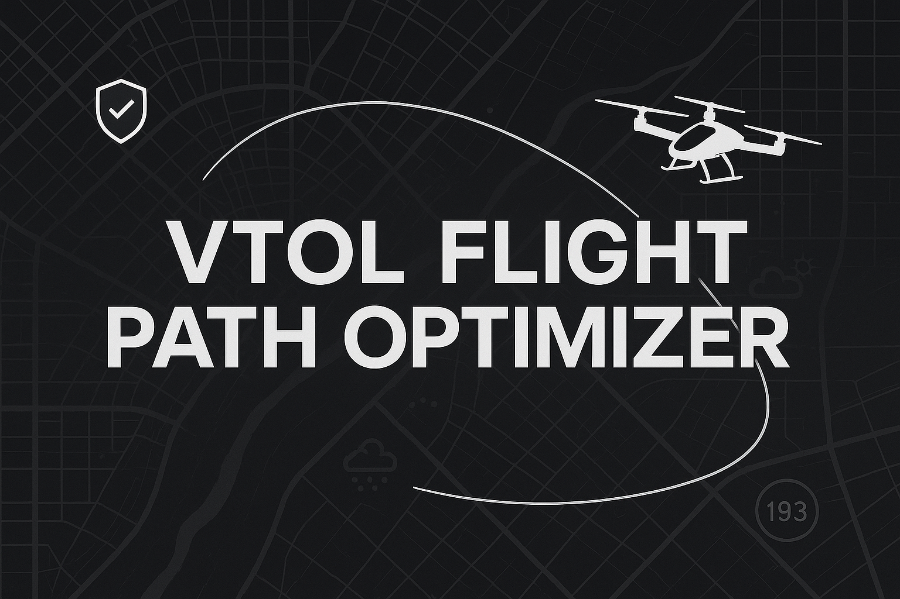

# VTOL Flight Path Optimizer

The VTOL Flight Path Optimizer is a Streamlit-based web app that allows users to simulate and plan low-altitude urban air routes. Designed with mobile users in mind, the app currently requires you to input latitude and longitude coordinates, but future updates will include address entry and drag-and-drop functionality.

## Features

- Latitude and longitude route planning (address input and drag-and-drop coming soon)
- Cruise altitude selection
- Real-time path visualization
- Mobile-friendly interface
- Regulatory-aware routing (coming soon)

## How to Use

1. Open the app in your browser or mobile device.
2. Enter your start and end coordinates.
3. Select your desired cruise altitude.
4. Click Optimize Route to view the suggested path.

## Tech Stack

- Python
- Streamlit
- Leaflet.js (via Streamlit components)
- Shapely & Geopandas
- FAA dataset integration (in progress)

## Future Enhancements

- Drag-and-drop and address-based inputs
- Real-time obstacle and weather integration
- Energy modeling
- Full regulatory dataset overlay
- Exportable flight plans

## Notes

- The FAA dataset will enable users to avoid no-fly zones and restricted airspace.
- FAA data source (download manually): https://nfdc.faa.gov/webContent/28DaySub/2025-04-18.zip

## License

MIT
