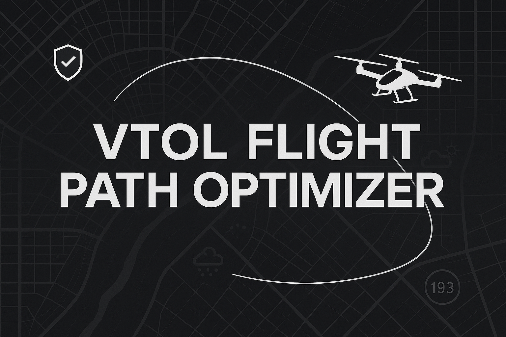

# VTOL Flight Path Optimizer

The VTOL Flight Path Optimizer is a Streamlit-based web app that allows users to simulate and plan low-altitude urban air routes. Designed with mobile users in mind, the app currently uses latitude and longitude input, but will soon support drag-and-drop route planning and address entry.

## Features

- Latitude and longitude-based route planning (address input and drag-and-drop coming soon)
- Cruise altitude selection
- Real-time path visualization
- Mobile-friendly interface
- Regulatory-aware routing (coming soon)

## FAA Dataset Integration

We are integrating FAA regulatory data to help users avoid **no-fly zones and restricted airspace**.

**Access the FAA shapefiles here:**

- [FAA Special Use Airspace Dataset (ArcGIS)](https://hub.arcgis.com/datasets/faa::special-use-airspace/about)
- [FAA National Security UAS Flight Restrictions](https://udds-faa.opendata.arcgis.com/datasets/faa::national-security-uas-flight-restrictions-1/about)

## License

MIT
