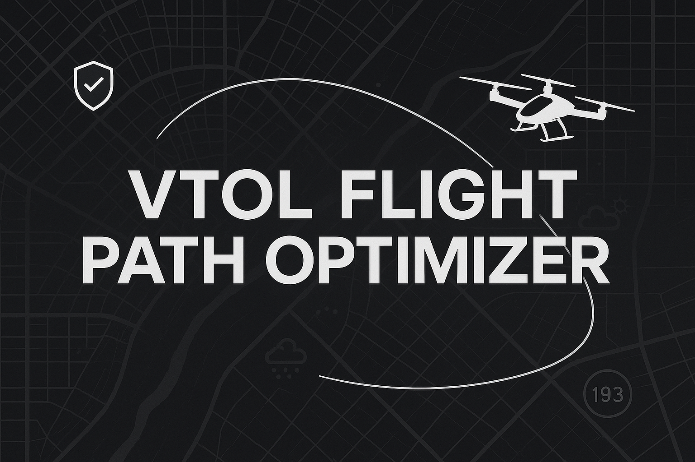

# VTOL Flight Path Optimizer

## Overview

The VTOL Flight Path Optimizer is a Streamlit-based web app that allows users to simulate and plan low-altitude urban air routes. Designed with mobile users in mind, the app allows you to drag and drop start and end points on an interactive map, adjust cruise altitude, and visualize optimized paths for VTOL (Vertical Take-Off and Landing) aircraft.

## Features

- Drag-and-drop route planning on an interactive map
- Cruise altitude selection
- Real-time path visualization
- Mobile-friendly interface
- Regulatory-aware routing (coming soon)

## How to Use

1. Open the app in your browser or mobile device.
2. Drag the pins to set your start and end points.
3. Select your desired cruise altitude.
4. Click **Optimize Route** to view the suggested path.

## Tech Stack

- Python
- Streamlit
- Leaflet.js (via Streamlit components)
- Shapely & Geopandas
- FAA dataset integration (in progress)

## Future Enhancements

- Real-time obstacle and weather integration
- Energy modeling
- Full regulatory dataset overlay
- Exportable flight plans

---

**Try it live:** [Your Streamlit App Link]

**License:** MIT
